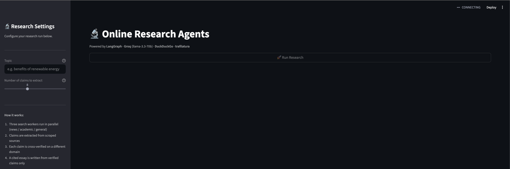

# Online Research Agents

A multi-agent research system that takes a topic, automatically gathers web sources, extracts and cross-verifies factual claims, and writes a cited essay — all without human intervention.

Built with **LangGraph**, **Groq** (free tier), and **DuckDuckGo** (no API key needed).

---

## How It Works

```
                         ┌─────────────────┐
                         │  Streamlit UI   │  browser-based, verbose live output
                         └────────┬────────┘
                                  │ topic + num_claims
                                  ▼
              ┌───────────────────────────────────────┐
              │          LangGraph Pipeline           │
              │                                       │
              │  START → search_news     ─┐           │
              │  START → search_academic  ├→ merge    │
              │  START → search_general  ─┘           │
              │              │                        │
              │              ▼                        │
              │          extract → verify → write     │
              └───────────────────────────────────────┘
                                  │
                                  ▼
                     Essay with inline citations
                     + verification summary table
```

### The Four Agents

| Agent | What it does |
|---|---|
| **Search Agent** (×3 parallel) | Generates angle-biased queries (news / academic / general) via Groq LLM, scrapes ≥5 sources each via DuckDuckGo + trafilatura. Three workers run simultaneously. |
| **Extraction Agent** | Combines all scraped text, sends to Groq with structured output to extract exactly N factual claims as typed Pydantic objects. |
| **Verification Agent** | For each claim, searches DuckDuckGo for a corroborating source on a *different domain*. Marks each claim VERIFIED or UNVERIFIED. |
| **Essay Writer Agent** | Writes a 3–4 paragraph essay using only VERIFIED claims, with inline `[N]` citations and a full References section. |

---

## Prerequisites

- Python 3.11+
- A free [Groq API key](https://console.groq.com) (no credit card required)
- Internet access (DuckDuckGo search + page scraping)

---

## Setup

**1. Clone the repo**
```bash
git clone https://github.com/AkshayTharval/online-research-agents.git
cd online-research-agents
```

**2. Create a virtual environment and install dependencies**

With `uv` (recommended):
```bash
uv venv
uv pip install -e ".[dev]"
```

Or with plain pip:
```bash
python3 -m venv .venv
source .venv/bin/activate        # Windows: .venv\Scripts\activate
pip install -e ".[dev]"
```

**3. Configure your Groq API key**
```bash
cp .env.example .env
# Edit .env and paste your key:
# GROQ_API_KEY=gsk_...
```

---

## Running the UI

```bash
# With uv:
uv run streamlit run src/online_research_agents/ui.py

# With plain venv:
.venv/bin/streamlit run src/online_research_agents/ui.py
```

This opens **http://localhost:8501** in your browser automatically.

### What you'll see



> **Note:** Screenshot will be added after the UI (Task 12) is complete and the app has been run end-to-end.

The UI shows:
- **Sidebar** — topic input + number of claims slider + Run button
- **Search Agent** expander — each source URL as it is collected (domain + char count)
- **Extraction Agent** expander — each extracted claim as a bullet with source
- **Verification Agent** expander — live table with VERIFIED / UNVERIFIED badges
- **Essay Writer** expander — spinner while writing, then the full cited essay
- **Final output** — essay as rendered Markdown + verification summary table + download button

---

## Running Tests

**Unit tests** (no API calls, fast):
```bash
pytest                          # default — runs 59 unit tests only
```

**Integration test** (real Groq API + real DuckDuckGo, ~60–120s):
```bash
pytest -m integration -v
```

The integration test requires `GROQ_API_KEY` in `.env` and internet access. It is automatically skipped if the key is missing.

---

## Project Structure

```
online-research-agents/
├── .env.example                          # Copy to .env, add your Groq key
├── pyproject.toml                        # Dependencies + build config
├── LOW_LEVEL_DESIGN.md                   # Detailed architecture document
├── TASK_LIST.md                          # Build task tracker
│
├── src/online_research_agents/
│   ├── models.py                         # Shared Pydantic models (ResearchState etc.)
│   ├── config.py                         # Settings loaded from .env
│   ├── retry.py                          # @llm_retry, @web_retry decorators
│   ├── graph.py                          # LangGraph pipeline (build_graph, run_pipeline)
│   ├── ui.py                             # Streamlit web UI
│   └── agents/
│       ├── search_agent.py               # Parallel web search + scraping
│       ├── extraction_agent.py           # Structured claim extraction
│       ├── verification_agent.py         # Cross-domain corroboration
│       └── essay_agent.py               # Cited essay generation
│
└── tests/
    ├── test_retry.py                     # 11 unit tests
    ├── test_search_agent.py              # 10 unit tests
    ├── test_extraction_agent.py          # 8 unit tests
    ├── test_verification_agent.py        # 14 unit tests
    ├── test_essay_agent.py               # 16 unit tests
    └── test_integration.py              # 15 end-to-end assertions (real APIs)
```

---

## Retry Behaviour

All LLM and web calls use `tenacity` retry logic:

| Call type | Max attempts | Backoff | Catches |
|---|---|---|---|
| Groq LLM | 5 | 2s → 16s exponential | `RateLimitError`, `APIStatusError` |
| DuckDuckGo / scraping | 3 | 1s → 4s exponential | `httpx`, `requests` transient errors |

Each retry is logged with the attempt number and wait duration.

---

## Groq Free Tier Notes

- Model used: `llama-3.3-70b-versatile`
- Free tier has rate limits (requests per minute / tokens per day)
- The retry logic handles transient `429 Rate Limit` errors automatically
- For a topic with `--num-claims 8`, the pipeline makes ~4 LLM calls total
- If you hit persistent rate limits, reduce `num_claims` or wait a minute and retry

---

## Key Design Decisions

- **Parallel search workers** — three agents run concurrently (news / academic / general angle), each collecting ≥5 sources, merged and deduplicated before extraction. Reduces search phase time by ~3×.
- **Structured LLM output** — `langchain_groq.with_structured_output()` guarantees typed `list[Claim]` back from the LLM; no regex or JSON parsing.
- **Cross-domain verification** — a claim from `bbc.com` corroborated only by another `bbc.com` URL is marked UNVERIFIED. Corroboration must come from a different domain.
- **Shared retry utility** — `retry.py` is the single source of truth for all retry logic; no duplication across agents.

For a full architecture deep-dive, see [LOW_LEVEL_DESIGN.md](LOW_LEVEL_DESIGN.md).
